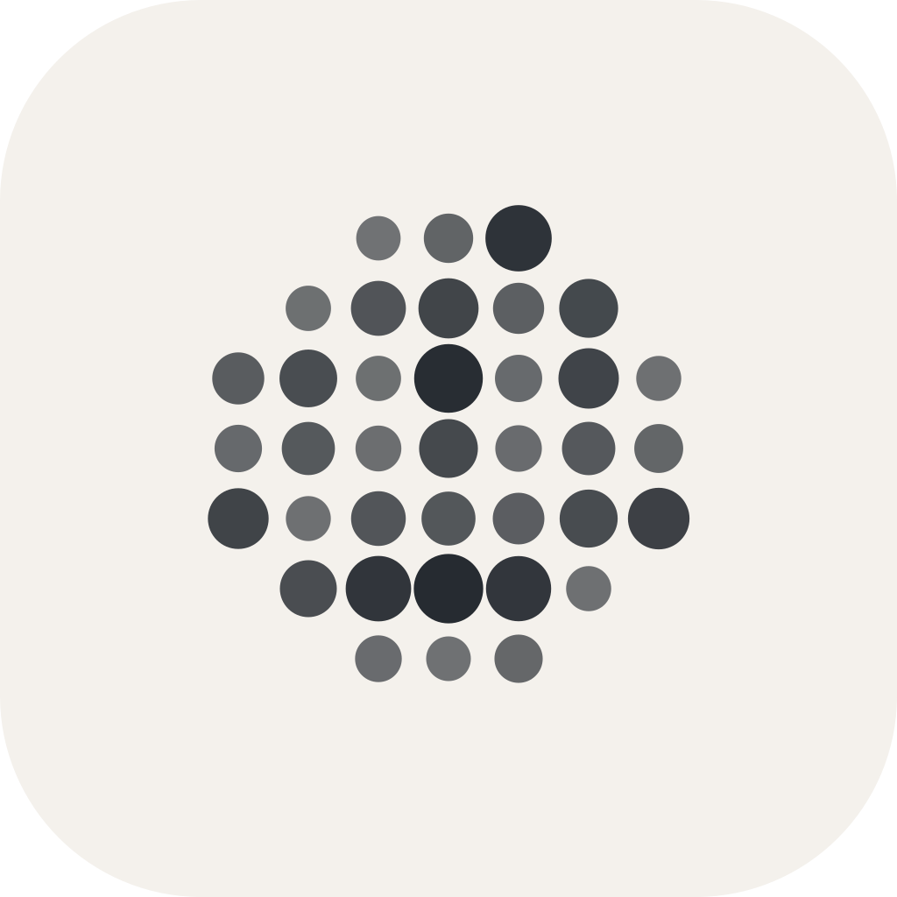
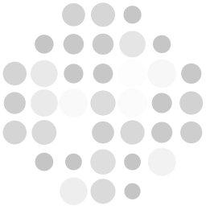

<p align="center">
  
</p>

<h1 align="center">Operator</h1>

<p align="center">
  Mission control for working agents.
</p>

<p align="center">
  <em>You run the agents. Operator makes the work visible and steerable.</em>
</p>

---

Operator is a desktop app for orchestrating Claude Code. Define agents and the model each task runs on, launch sessions that delegate to them, and follow every tool call and subagent live — each in its own git worktree — approving or denying anything they touch, inline as they go.

### The problem

You want to run several Claude Code sessions at once — one refactoring a module, one writing tests, one debugging a deploy script — and let each delegate to subagents. But each session lives in its own terminal: you're constantly switching between them, scanning for permission prompts, with no view of who delegated to whom, how long a tool ran, or what any of it cost. And running them in parallel against the same repo means they trip over each other's changes.

### What Operator does

- **A project roster, coordinated by Operator.** Give a project a team of agent *lanes* — **Operator** (the coordinator), Research, Code, Review, Design, QA — each pinning a model, reasoning effort, an optional isolated worktree, and a standing charter. Drag to reorder, click to select, launch one or several. The Operator lane knows the team and routes work to the best-suited lane, doing the job itself when none fits.
- **Delegation that actually lands.** An agent hands work off with a single line (`OPERATOR-DISPATCH [lane] task`); Operator types it into that lane if it's running — or **launches the lane** with the task as its opening brief if it isn't — and tells the sender how it landed. Directives parse even when the model wraps them in bullets or backticks, submissions are spaced and nudged so they can't merge or strand in the composer, and every dispatch is logged with its outcome.
- **A task queue with provenance.** Tasks carry who ran them, where, and the resulting diff — with an optional check command (`npm test`) that has to go green before a task reads "done".
- **An agent library with per-task models.** A visual editor over your `.claude/agents/*.md` — the headline being which model runs each agent (Haiku for extraction, Sonnet for general work, Opus for hard reasoning), with cost/speed hints right at the point of choice.
- **A live orchestration timeline.** Watch each session's tool calls and subagent delegations as they happen — nested by who-spawned-whom, with a live-ticking duration on the in-flight tool and elapsed time on finished ones. Reconstructed straight from Claude Code's own transcripts, so it needs nothing installed.
- **Isolated worktrees + fan-out.** Run multiple agents on one repo in parallel — each gets its own git worktree, so changes never collide. Fan a single task out across N parallel agents, each badged so the group reads at a glance.
- **In-app diff review.** See each session's changes in a built-in diff viewer, then **Commit**, **Merge** back to your base branch, or **Discard** — no terminal required.
- **A usage & cost dashboard.** Token-driven insights into what's driving your usage (high-context, subagent-heavy, and long-running sessions), plus a Claude-Code-`/usage`-style per-model breakdown — input/output/cache, cost, and API vs. wall time.
- **Three ways to watch one session.** **Console** (the real terminal), **Chat** (a document-style read of the conversation with its own composer), and **Preview** — a live view of the app the session is building, with the port discovered by walking that session's own process tree rather than guessing, and a picker when it's serving several. Annotate the preview with pins and boxes, or inspect a real element down to `component@file:line`, and send either straight to the agent or the task queue.
- **Drop & click.** Drop an image anywhere on the window to paste its path into the active session, and click links in the terminal to open them in your browser.
- **Never lose your place.** Open sessions are saved continuously to a crash-safe store; relaunch and pick up under "Continue where you left off" — **Resume** the exact conversation or reopen clean. Resume a whole **project** in one action (every previously open agent comes back, each continuing its conversation), and keep the sidebar curated: projects collapse, reorder (whole groups *and* agents within them), and close as a unit.
- **Self-updating.** New tagged releases are signed, notarized, and published automatically; the app checks on launch and offers a one-click "Install & Restart".
- **Command palette** (`Cmd+K`), themes, and a menu-bar tray whose menu lists your active sessions and their live states.

### How it works

Operator is a **pure observer** of the sessions it launches — nothing installed, no global config, no machine-wide hooks. It pins each session's id at launch (`claude --session-id <uuid>`) and tails that session's transcript to rebuild the timeline live:

```
Operator  ──spawns──▶  embedded terminal  ──▶  claude --session-id <id>
                                                 │
                       writes ~/.claude/projects/<slug>/<id>.jsonl
                                                 │
              Operator tails it → live timeline (tools, subagents, phase, cost)
```

Permissions are handled by Claude Code itself in the terminal as usual; Operator doesn't intercept them. A `claude` you run elsewhere is completely unaffected.

### Quick start

```bash
npm install
npm run tauri dev   # or `npm run dev` for the frontend alone
```

Click **+ New Session**, pick a folder, and start. If the folder is a git repo, worktree isolation defaults on; bump **Agents** above 1 to fan the same task out across parallel worktree agents.

### Development

```bash
npm test                       # unit tests (vitest)
cargo test --manifest-path src-tauri/Cargo.toml
npm run build                  # tsc + vite
```

The terminal is the hard part of this app, so it has its own harnesses. Each boots the
**production** xterm config in headless WebKit (the same engine family as the app's
WKWebView) rather than a stand-in:

| Command | Answers |
| --- | --- |
| `npm run verify:width` | Do xterm and Claude Code agree on every glyph's cell width? (A disagreement drifts the cursor and garbles scrollback.) |
| `npm run verify:dom` | Does the DOM renderer leave stale text under incremental writes? (Separates a renderer bug from a compositor one.) |
| `npm run verify:visual` | What do the symbol/emoji fallback paths actually render? |
| `npm run verify:input` | Do keystrokes reach the pty in order? |

`dev/` holds a mock `window.operator` bridge that boots the real renderer against
fixtures in a plain browser, so the UI can be driven and screenshotted without the Tauri
shell (`node dev/mock-check.mjs`, `dev/drive-palette.mjs`, …). It's development-only —
the production build declares its entry points explicitly, so `dev/` is never bundled.

### Building a signed & notarized release

The build is configured to sign with the `Developer ID Application` identity in `src-tauri/tauri.conf.json` (hardened runtime + `entitlements.plist`). Signing happens automatically; notarization runs too if Apple credentials are present in the environment:

```bash
# one-time: generate an app-specific password at appleid.apple.com
export APPLE_ID="you@example.com"
export APPLE_PASSWORD="xxxx-xxxx-xxxx-xxxx"   # app-specific password
export APPLE_TEAM_ID="UJS4C5GUCW"

npm run tauri build                           # signs, notarizes, and staples
```

Without those variables the build still produces a signed (un-notarized) `.app` + `.dmg` — fine for local use, but Gatekeeper will warn on other machines. App Store Connect API keys (`APPLE_API_KEY` / `APPLE_API_ISSUER` / `APPLE_API_KEY_PATH`) work as an alternative to the Apple ID variables.

### Keyboard

| Shortcut | Action |
| --- | --- |
| `Cmd+K` | Command palette — sessions, but also Operator's own functions: switch surface, open Plan/Diff, launch a project's lane, start its queued backlog |
| `Cmd+N` | New session |
| `Cmd+W` | Close active session |
| `Cmd+J` | Console ⇄ Chat |
| `Cmd+E` | Preview: Interact ⇄ Annotate |
| `Cmd+1`–`9` | Switch session |

### Stack

React 19 + Vite + Tailwind 4 frontend on a **Tauri 2 (Rust)** backend — `portable-pty` for the embedded terminals, xterm.js (DOM renderer) for the terminal surface, a transcript tailer that rebuilds the session timeline, and `serde`/`serde_yaml` for the agent library, projects, and the durable session store. The build produces a ~10 MB signed app.

### Brand & assets

All brand assets live under [`assets/`](assets/). The mark is a dot-matrix circle — a "frozen twinkle" (each dot a different size/opacity) — the same geometry the app animates live in the sidebar (`LogoMark`) and per-session status (`StatusWave`).

<table>
  <tr>
    <th align="left">Asset</th>
    <th align="center">Preview</th>
    <th align="left">Files</th>
  </tr>
  <tr>
    <td><strong>App icon</strong><br/>macOS app / Dock icon — cream rounded-rect, dark dot-circle.</td>
    <td align="center"></td>
    <td><code>logos/icon-source.svg</code><br/><code>logos/icon-source.png</code> (1024²)<br/><code>logos/icon.icns</code></td>
  </tr>
  <tr>
    <td><strong>Sidebar mark</strong><br/>The dot-circle on its own, transparent. Light dots for dark UI, dark dots for light UI.</td>
    <td align="center">
      <picture>
        <source media="(prefers-color-scheme: dark)" srcset="assets/logos/mark-128.png" />
        
      </picture>
    </td>
    <td><code>logos/mark.svg</code> · <code>mark-light.svg</code><br/><code>logos/mark-64.png</code> · <code>mark-128.png</code><br/><code>logos/mark-light-64.png</code></td>
  </tr>
  <tr>
    <td><strong>Menu-bar tray icon</strong><br/>The dot-circle as a monochrome macOS template (auto light/dark).</td>
    <td align="center">
      <picture>
        <source media="(prefers-color-scheme: dark)" srcset="assets/logos/mark-64.png" />
        
      </picture>
    </td>
    <td><code>src-tauri/icons/tray.png</code> (the icon the app loads)</td>
  </tr>
  <tr>
    <td><strong>Status indicator</strong><br/>The six "thinking" shimmer frames behind the live session status.</td>
    <td align="center"></td>
    <td><code>status-indicator/state-1.svg</code> … <code>state-6.svg</code></td>
  </tr>
</table>

> The dot-circle mark is generated from the same algorithm as the in-app `LogoMark` (37 dots, deterministic frozen-twinkle weighting). The older bars-in-circle logo (`logos/logo.svg`, `logo-64.png`, `logo-light-64.png`, and the legacy `logos/trayTemplate*.png`) is retained for reference but no longer used in the UI.

### License

Private
